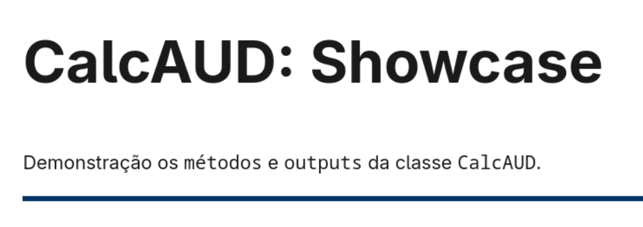

# 🧮 CalcAUD - Calculadora Auditável

[](https://jsr.io/@st-all-one/calcaud-nbr-a11y)
[](LICENSE)

O projeto **CalcAUD** é uma mini-engine para cálculo matemático com rastreio auditável e acessível para uso prático.

Através de técnicas de precisão fixa em `BigInt`, `imutabilidade interna`, separação rigorosa entre `cálculo e visualização` e algoritmos state-of-art, essa lib permite segurança e auditabilidade para aplicações críticas e velocidade para aplicações normais.

## Showcase
---
[](https://calcaud.st-all-one.deno.net/)

- [LINK DO SHOWCASE](https://calcaud.st-all-one.deno.net/)

---

## 🎯 Motivação: Por que CalcAUD?

No desenvolvimento de software financeiro moderno, o uso de `number` (float) é um risco. Erros de arredondamento inerentes ao padrão IEEE 754 (ex: `0.1 + 0.2 !== 0.3`) podem causar prejuízos acumulados e falhas em auditorias fiscais.

### Para Desenvolvedores
- **Precisão Arbitrária:** Escala interna fixa de 10¹² usando `BigInt`.
- **Imutabilidade Estrita:** Operações sem efeitos colaterais.
- **Ecossistema JSR:** Compatível com Deno, Node.js e Bun.

### Para Negócios e Auditores
- **Rastreabilidade:** Cada resultado carrega sua "memória de cálculo".
- **Conformidade NBR-5891:** Implementação rigorosa do arredondamento bancário/científico (arredonda para o par mais próximo).
- **Transparência:** Gere provas visuais em LaTeX instantaneamente para relatórios e comprovantes.

### Para Acessibilidade (A11y)
- **Texto verbal:** Gera descrições verbais inteligentes para leitores de tela em 8 idiomas.
- **Inclusão:** Diferencia visualmente e auditivamente a precedência de operações.

---

## 🚀 Quick Start

### Instalação:

```bash
deno    add jsr:@st-all-one/calcaud-nbr-a11y
pnpm      i jsr:@st-all-one/calcaud-nbr-a11y
yarn    add jsr:@st-all-one/calcaud-nbr-a11y
vlt install jsr:@st-all-one/calcaud-nbr-a11y
npx     jsr add @st-all-one/calcaud-nbr-a11y
bunx    jsr add @st-all-one/calcaud-nbr-a11y
```

### Exemplo de Uso

```typescript
import { CalcAUD } from "@st-all-one/calcaud-nbr-a11y";

// Item de R$ 150.50 com 15% de desconto + R$ 25.00 de frete
const preco = CalcAUD.from("150.50");
const total = preco
  .sub(preco.mult("0.15"))  // Aplica desconto
  .group()                  // Agrupa para auditoria visual
  .add("25.00");            // Soma frete

const output = total.commit(2, { locale: "pt-BR", currency: "BRL" });

console.log(output.toMonetary());    // "R$ 152,93"
console.log(output.toUnicode());     // (150.50 - 150.50 × 0.15) + 25.00 = ...
console.log(output.toVerbalA11y());  // "150 ponto 50 menos em grupo..."
```

---

## 📖 Docs

- [**Motor de Precisão (BigInt)**](docs/specs/00-ADR-Architecture.md)
- [**Algoritmos Matemáticos**](docs/specs/01-Core-Math-Engine.md)
- [**Estratégias de Arredondamento**](docs/specs/05-Rounding-Strategies.md)
- [**Segurança e Parsing**](docs/specs/02-Security-And-Parsing.md)
- [**Acessibilidade e i18n**](docs/specs/04-I18n-And-A11y.md)

---

**CalcAUD (NBR-A11y)** é um projeto de código aberto sob licença **Apache 2.0**, focado em trazer acessibilidade e precisão matemática financeira para a web moderna.
