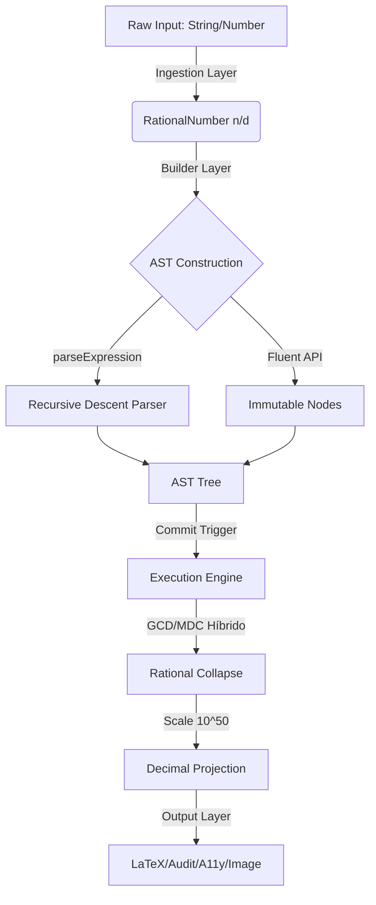
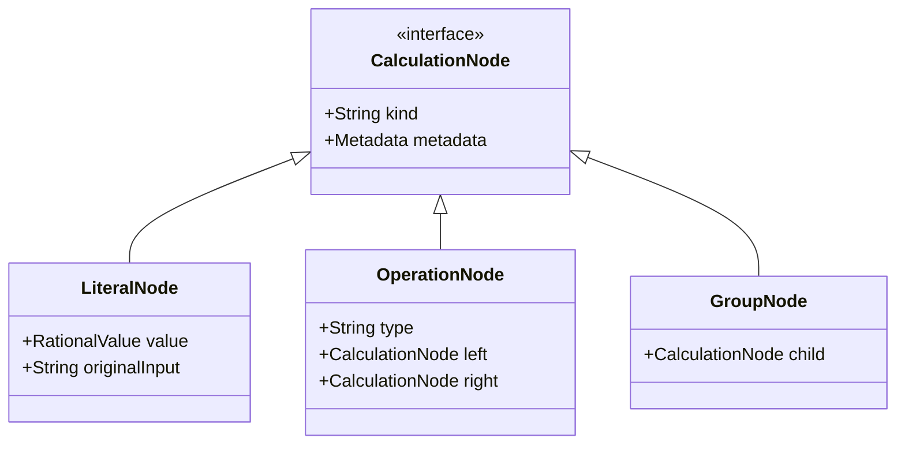

# Arquitetura Interna e Ciclo de Vida (Lifetimes)

A **CalcAUY** não é uma simples calculadora; ela é um **Motor de Projeção Racional**. Diferente de bibliotecas matemáticas comuns que operam sobre resultados imediatos, a CalcAUY trata o cálculo como um processo evolutivo dividido em quatro estágios distintos de vida (Lifetimes), garantindo que a precisão e a auditabilidade sejam preservadas do nascimento ao arquivamento do dado.

---

## 🚀 Visão Geral do Pipeline

---

## 1. Fase de Ingestão: O Nascimento do Dado (Input Lifetime)

O primeiro lifetime da CalcAUY foca na **Higienização Léxica**. O objetivo é converter qualquer entrada em uma fração racional BigInt antes que ela toque na engine.

### O Parser Numérico Estrito
A ingestão não utiliza `parseFloat()`. Em vez disso, utiliza um conjunto de expressões regulares rigorosas (`BIGINT_RE`, `DECIMAL_RE`, `FRACTION_RE`) que capturam a intenção do usuário:
- **Separação de Base 10:** Ao ler `"10.50"`, a engine identifica 2 casas decimais e gera o racional `1050/100`.
- **Notação Científica:** `"1.2e3"` é expandido para `1200/1`.
- **Percentuais:** `"18%"` sofre normalização imediata para `18/100`.

### O Sistema Híbrido de Caches
Para suportar volumes industriais, a CalcAUY implementa uma arquitetura de cache em três níveis:
1.  **Session Cache (`using`):** Referências fortes locais ao escopo atual. Máxima performance.
2.  **Hot Cache:** Map estático das 512 constantes mais usadas (0, 1, 10, 1.18, etc).
3.  **Cold Cache (`WeakRef`):** Mantém números vivos apenas enquanto pertencem a alguma árvore ativa, permitindo que o GC limpe o resto.

---

## 2. Fase de Construção: A Estrutura Lógica (Build Lifetime)

Neste estágio, o cálculo existe como uma **Árvore de Sintaxe Abstrata (AST)**. Nenhum número é somado ou multiplicado aqui.

### Imutabilidade e Encadeamento
Cada operação (`.add()`, `.mult()`) retorna uma **nova instância** de `CalcAUY`. A árvore antiga permanece intacta, permitindo o reaproveitamento de ramos (Branching).

### Precedência e Associatividade à Direita
O motor respeita rigorosamente a precedência matemática (PEMDAS), com um detalhe de engenharia avançada:
- **Associatividade à Direita (Power Tower):** No método `pow()`, a CalcAUY segue o padrão acadêmico onde $a^b^c$ é $a^{(b^c)}$.
- **Auto-Agrupamento:** Ao injetar uma sub-árvore em outra, a engine detecta conflitos de precedência e aplica `GroupNodes` (parênteses) automaticamente para isolar o escopo léxico.

---

## 3. Fase de Execução: O Colapso Racional (Commit Lifetime)

O `commit()` aciona o motor de avaliação recursiva que percorre a árvore das folhas para a raiz.

### O Algoritmo GCD/MDC Híbrido
Para evitar que o numerador e o denominador cresçam indefinidamente (o que causaria lentidão), a cada passo intermediário a engine aplica o **Máximo Divisor Comum**:
- **Engenharia:** Combina atalhos de hardware (fast-paths) para números pares com o operador de módulo nativo executado em C++. Isso mantém as frações sempre em sua forma irredutível.

### Transição para Irracionais (Escala $10^{50}$)
Operações como `pow(0.5)` (Raiz Quadrada) não podem ser mantidas como frações exatas.
- **Solução:** A engine projeta o valor para uma escala de **50 casas decimais de precisão interna**.
- **Método de Newton:** Utiliza aproximações sucessivas em aritmética de inteiros gigantes para garantir que o erro de arredondamento seja ordens de magnitude menor que qualquer unidade monetária.

---

## 4. Fase de Projeção: Múltiplas Faces da Verdade (Output Lifetime)

O lifetime final é a **Projeção de Saída**. O resultado racional é transformado em formatos consumíveis por humanos ou máquinas.

### Algoritmo de Maior Resto (Slicing)
A CalcAUY resolve o problema do "centavo perdido" no rateio (`toSlice`) através de uma implementação determinística do Algoritmo de Maior Resto:
1. Divide a parte inteira igualmente.
2. Calcula o resíduo em centavos.
3. Distribui o resíduo um a um para as fatias que tiveram a maior perda decimal no arredondamento original.

### Renderização Multimodal
- **Audit Trace:** Snapshot JSON que permite reconstruir a árvore original em qualquer lugar do mundo.
- **LaTeX:** Tradução tipográfica para documentos de alta fidelidade.
- **Verbal A11y:** Tradução fonética recursiva que "fala" a árvore, respeitando pausas e parênteses.

---

## 5. Segurança e Integridade: O Lacre Digital (Integrity Lifetime)

Para garantir a **Imutabilidade Forense**, a CalcAUY implementa um sistema de lacre digital que protege a árvore de cálculo e seus resultados contra qualquer alteração externa.

### Geração da Assinatura (Signature)
A `signature` é gerada através de um processo determinístico de quatro etapas:
1.  **Canonização (Canonical K-Sort):** O objeto (seja a AST ou o rastro de auditoria) é transformado em uma string única. Todas as chaves do objeto são ordenadas alfabeticamente de forma recursiva, garantindo que a assinatura seja independente da ordem dos campos no JSON original.
2.  **Injeção de Salt:** Um segredo (`salt`) definido globalmente via `setSecurityPolicy` ou passado localmente é anexado à string canonizada. Isso garante que a assinatura seja exclusiva para aquele ambiente ou aplicação, dificultando ataques de dicionário ou manipulações em massa.
3.  **Hashing BLAKE3:** O payload final é processado pelo algoritmo **BLAKE3**, gerando um hash de alta performance e resistência militar contra colisões, garantindo a integridade total do rastro de auditoria.
4.  **Encoding Customizado:** O hash resultante é codificado utilizando o `encoder` configurado (suportando `HEX`, `BASE64`, `BASE58` ou `BASE32`). O padrão é **BASE58**, que oferece o melhor equilíbrio entre compactação e legibilidade humana para auditoria manual.

### Validação de Integridade
A integridade é verificada automaticamente durante o `hydrate()` ou via `checkIntegrity()`:
- A engine reconstrói a assinatura baseada no conteúdo atual e no salt fornecido.
- **Proteção contra Adulteração:** Se um único bit da AST ou do rastro de auditoria for modificado (ex: alteração de um valor, tipo de operação ou metadado), a assinatura deixará de coincidir e a CalcAUY lançará uma exceção crítica (`integrity-critical-violation`), impedindo o processamento de dados fraudados.

---

## Diagrama de Anatomia de um Nó (AST)

---

## Considerações de Engenharia Final

- **Independência de Runtime:** O core da CalcAUY é agnóstico. Ele não depende do sistema de arquivos ou rede, tornando-o seguro para rodar em Browsers, Deno, Node.js ou Cloud Workers.
- **Segurança Forense:** O uso de `#private fields` garante que nem mesmo via depuração comum um desenvolvedor possa alterar o numerador ou denominador de um número já criado.
- **Auditabilidade Bit-a-Bit:** Através da estratégia de arredondamento `NONE`, a biblioteca permite a verificação de integridade total, onde o input é preservado e o output é a representação decimal direta da fração acumulada.
