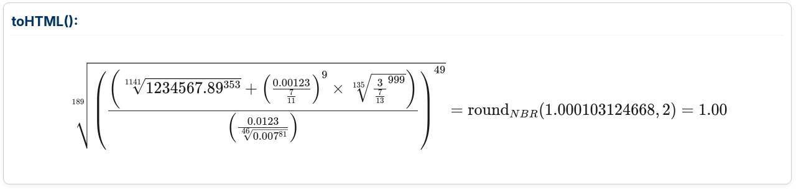
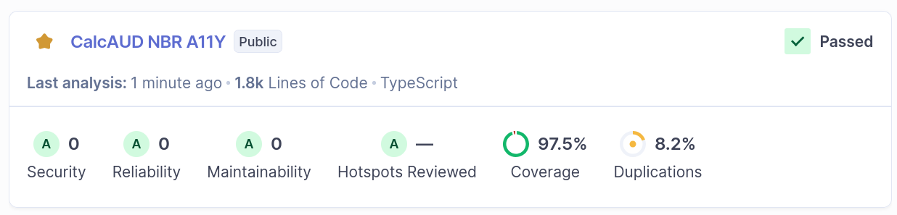
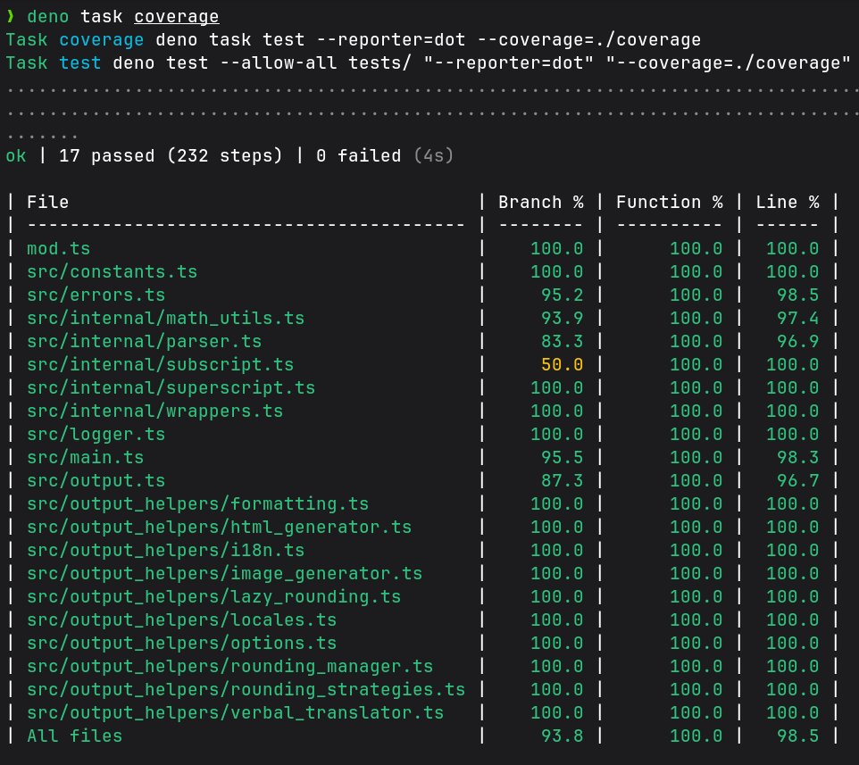

<header align="center">

# CalcAUD (Calculation & Audit)

**Motor de Execução Transparente para Engenharia Financeira**

[](https://jsr.io/@st-all-one/calcaud-nbr-a11y)
[](LICENSE)

</header>

A **CalcAUD** é uma solução de infraestrutura em **TypeScript**, concebida para neutralizar a imprecisão do padrão IEEE 754 em sistemas de missão crítica. É baseada em um paradigma de **imutabilidade estrita** e **proveniência de dados** (Data Provenance), a biblioteca assegura a integridade atuarial sob rigor normativo, transformando cada operação em uma evidência matemática transparente e auditável.

---

## 🚀 Quick-start

#### **Instalação:**
```bash
deno    add jsr:@st-all-one/calcaud-nbr-a11y
pnpm      i jsr:@st-all-one/calcaud-nbr-a11y
yarn    add jsr:@st-all-one/calcaud-nbr-a11y
vlt install jsr:@st-all-one/calcaud-nbr-a11y
npx     jsr add @st-all-one/calcaud-nbr-a11y
bunx    jsr add @st-all-one/calcaud-nbr-a11y
```

#### **Execução:**
```ts
import { CalcAUD } from "@st-all-one/calcaud-nbr-a11y";

// ==== Cálculo de Juros Compostos M = C * (1 + i)^t ====

// 1. Definição dos Parâmetros (Input Sanitized)
const capital = CalcAUD.from("1000.00");
const taxa = CalcAUD.from("0.10"); // 10% a.a.
const tempo = 3; // 3 anos

// 2. Construção da Expressão Auditável
// M = C * (1 + i)^t
const montante = capital.mult(
    CalcAUD.from(1)      // Valor base unitário
        .add(taxa)       // Soma da taxa (1 + i)
        .group()         // Enclausura para garantir (1.10) na AST e LaTeX
        .pow(tempo)      // Eleva ao tempo (t)
).commit(2);             // Arredondamento NBR 5891 para 2 casas

//3. Extração dos resultados (Mult-modal Output)
console.log(montante.toMonetary());
    // "R$ 1.331,00"
console.log(montante.toUnicode());
    // "1000.00 × (1 + 0.10)³ = roundₙʙᵣ(1331, 2) = 1331.00"
console.log(montante.toLaTeX());
    // "$$ 1000.00 \times {\left( 1 + 0.10 \right)}^{3} = \text{round}_{NBR}(1331, 2) = 1331.00 $$"
console.log(montante.toVerbalA11y());
    // 1000 vírgula 00 multiplicado por em grupo, 1 mais 0 vírgula 10, fim do grupo elevado a 3 é igual a 1331 vírgula 00 (Arredondamento: NBR-5891)
```

#### **Showcase**

> - 
> > [LINK DO SHOWCASE](https://calcaud.st-all-one.deno.net/)

---

## 📖 Documentação e Exemplos

- [**Motor de Precisão (BigInt)**](docs/specs/00-ADR-Architecture.md)
- [**Algoritmos Matemáticos**](docs/specs/01-Core-Math-Engine.md)
- [**Estratégias de Arredondamento**](docs/specs/05-Rounding-Strategies.md)
- [**Segurança e Parsing**](docs/specs/02-Security-And-Parsing.md)
- [**Acessibilidade e i18n**](docs/specs/04-I18n-And-A11y.md)

---

## Testes

> - 
> > *SonarQube, Teste realizado em 25/03/2026*

> - 
> > *Deno Coverage, teste realizado em 25/03/2026*
---

## 🎯 Por que essa lib existe?

No desenvolvimento de software financeiro moderno, o uso de `number` (float) é um risco. Erros de arredondamento inerentes ao padrão IEEE 754 (ex: `0.1 + 0.2 !== 0.3`) podem causar prejuízos acumulados e falhas em auditorias fiscais.

### Para Desenvolvedores

- **Precisão Arbitrária:** Escala interna fixa de 10¹² usando `BigInt`.
- **Imutabilidade Estrita:** Operações sem efeitos colaterais.
- **Ecossistema JSR:** Compatível com Deno, Node.js e Bun.

### Para Negócios e Auditores

- **Rastreabilidade:** Cada resultado carrega sua "memória de cálculo".
- **Conformidade NBR-5891:** Implementação rigorosa do arredondamento bancário/científico (arredonda para o par mais próximo).
- **Transparência:** Gere provas visuais em LaTeX instantaneamente para relatórios e comprovantes.

### Para Acessibilidade (A11y)

- **Texto verbal:** Gera descrições verbais inteligentes para leitores de tela em 8 idiomas.
- **Inclusão:** Diferencia visualmente e auditivamente a precedência de operações.

---

### **Arquitetura do projeto:**

#### Princípios:

- **Domain Agnosticism:** A `CalcAUD` não foi desenhada com foco em um cenário específico, como cálculo de IOF ou demonstrações matemáticas, é uma lib projetada para ser uma infraestrutura rígida para execução prática de cálculos aritméticos e um sistema utilitário de formatação de dados, cabendo a implementação ao utilizador.

- **Separation os Concerns (SoC):** A `CalcAUD` opera através de uma cadeia de imutabilidade total. Ao fim do cálculo (o método `.commit()`) é gerada a instância da 2ª engine, a `CalcAUDOutput`, na qual todo processo de formatação ocorre, prevenindo contaminação ao processo de cálculo intermediário.

- **Immutable and Accumulator Patterners:** Cada método executado gera uma nova instância da `CalcAUD`, garantindo **Thread-Safety** em tempo de execução e criando um rastro contínuo do cálculo. Ao final do `.commit()` os dados são transferidos para `CalcAUDOutput`.

- **Fluent Interface/DX:** A lib prioriza a legibilidade natural, não apenas no resultado ao usuário final, mas também no processo, permitindo criar cadeias de execução lógicas em nível de código.
    - Ex: `CalcAUD.from(10).add(5).mult(5).commit()`.
    - Ex: `CalcAUD.from(100_000_000).pow("2/3").add("12.5").commit()`
    - Ex: `CalcAUD.from(10).add(5).group().mult(20).group().pow(2).commit()`

- **Accessibility:** Geração síncrona de provas em `LaTeX`, e descrições verbais (A11y), garantindo que o cálculo seja interpretável tanto por auditores quanto por tecnologias assistivas.

#### Engine Aritmética

- **Aritmética de Ponto Fixo:** Diferente do *Ponto Flutuante* do JavaScript, é usada uma base fixa (10¹²) em **BigInt**, não sendo limitado pelos 64 bits do padrão IEEE 754.

- **Normatização total:** Aplicação de um **Parser rigoroso** em todas as entradas de dados, prevenindo ambiguidades e garantindo conversão correta para a base interna.

#### Integridade e Auditoria

- **Audit Trail:** Todas as operações realizadas pela `CalcAUD` geram rastros cumulativos no momento de execução, podendo reconstruir o cálculo mesmo em cenários de erro.

- **Execution Transparency:** Ao executar o método `.commit()` nenhum dado é persistido ou ocultado, e sim transferido para instância de `CalcAUDOutput`, a qual é uma "porta aberta" para ler, lidar e formatar as informações e todo o rastro de criação delas.

---

<footer align="center">

**CalcAUD** é um projeto de código aberto sob licença **MPL-2.0**, focado em trazer acessibilidade e precisão matemática financeira para a web moderna.

</footer>
