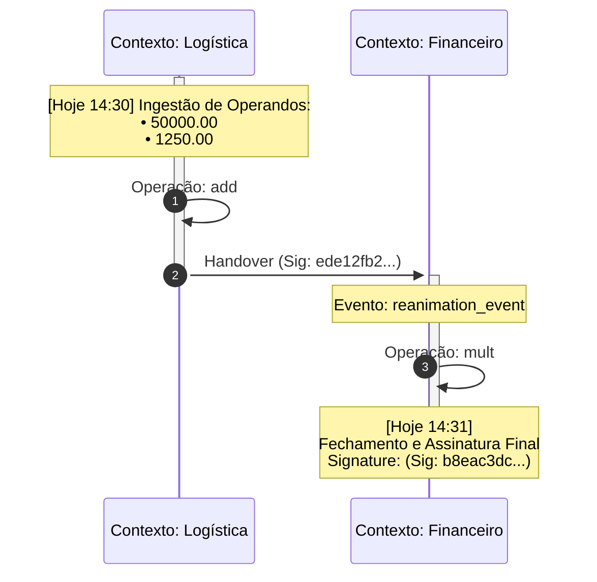

# Método: `toMermaidGraph()`

O `toMermaidGraph()` gera um diagrama de sequência Mermaid que representa o cálculo não como uma estrutura estática, mas como uma jornada cronológica de eventos e transições de estado (**Ledger-view**).

## ⚙️ Funcionamento Interno

1.  **Flattener de Linhagem:** Diferente dos outros renderizadores, este motor "desmonta" a árvore recursiva para identificar a ordem real dos eventos (origem -> transição -> fechamento).
2.  **Mapeamento de Participantes:** Identifica automaticamente todos os `contextLabel` envolvidos (via nós `control`) e os define como participantes no diagrama.
3.  **Rastro de Handover:** Cada evento de reidratação (`hydrate`) ou união externa (`fromExternalInstance`) é representado por uma transição explícita entre jurisdições, carregando a assinatura do rastro original.
4.  **Lacre Final:** O diagrama encerra com o evento de assinatura final do contexto atual.

## 🎯 Propósito
Visualizar a "cadeia de custódia" do cálculo. É a ferramenta definitiva para explicar a auditores e stakeholders como um valor complexo foi consolidado a partir de diferentes módulos ou jurisdições.

## 💼 Exemplos de Uso

### 1. Auditoria de Integração (Supply Chain)
Visualizar como um custo nasceu na Logística e recebeu impostos no Financeiro.
```typescript
const graph = res.toMermaidGraph();
// Retorna uma string DSL Mermaid pronta para renderização.
```

### 2. Documentação Técnica Dinâmica
Gerar diagramas automáticos para memoriais de cálculo técnicos em sistemas de documentação que suportam Mermaid.

### 3. Debug de Linhagem
Identificar rapidamente de qual contexto um valor específico veio em árvores extremamente complexas.

## 📊 Exemplo de Output (DSL Mermaid)



## 🏗️ Anotações de Engenharia
- **Performance:** O gráfico é gerado uma única vez por instância e armazenado em cache (`#outputCache`).
- **Sanitização:** O renderizador utiliza aliases seguros para garantir que caracteres especiais nos nomes dos contextos não quebrem a sintaxe Mermaid.
- **Transparência Forense:** As assinaturas são truncadas para 8 caracteres para manter a legibilidade, mas servem como prova de que o handover foi verificado.
