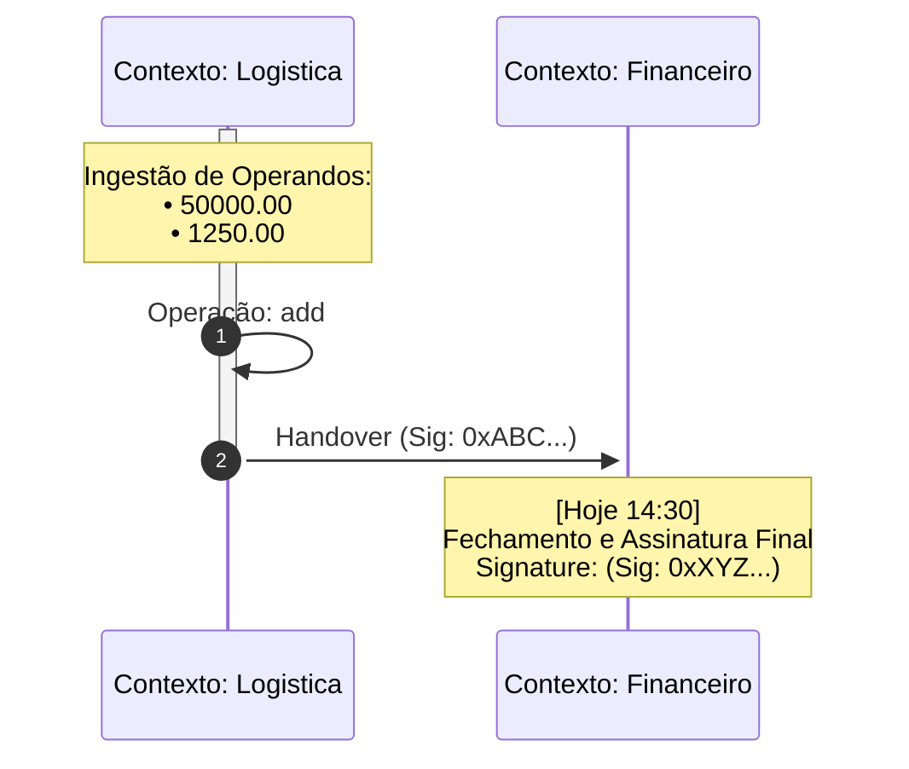

# 21 - Auditoria de Linhagem Visual (Mermaid Sequence Ledger)

## Objetivo
Estabelecer o padrão de visualização cronológica da CalcAUY, transformando a estrutura técnica da AST em uma narrativa de eventos legível para humanos e auditores. O rastro Mermaid não é apenas uma representação matemática, mas um **Livro-Razão (Ledger)** de transições de jurisdição.

## 1. Filosofia do "Filme" vs "Foto"
Diferente do LaTeX (que é uma "foto" estática da fórmula final), o `toMermaidGraph` gera um "filme" da construção do cálculo:
- **Origem (Esquerda):** Onde o dado nasceu.
- **Setas de Handover:** O momento em que o dado cruzou fronteiras departamentais ou de sistemas.
- **Self-Calls:** Processamentos internos de uma jurisdição.
- **Lacre (Direita):** O fechamento final com assinatura de integridade.

## 2. Ordenação por Profundidade de Dependência (Anti-Espaguete)
Para evitar o "Efeito Espaguete" (setas cruzando o diagrama desordenadamente em cenários corporativos complexos), o motor de renderização pré-calcula a **Profundidade de Linhagem (Lineage Depth)** através de um percurso recursivo na AST:
1.  **Consolidador (Raiz):** Profundidade 0 (Extrema Direita).
2.  **Transformadores:** Profundidade N (Meio).
3.  **Fontes Primárias:** Profundidade Máxima (Extrema Esquerda).

O Mermaid declara os participantes nesta ordem decrescente de profundidade, garantindo que o fluxo temporal e de dados flua harmoniosamente da esquerda para a direita, como uma cascata.

## 3. Gestão de Fadiga Visual (UX Forense)

### A. Agrupamento de Operandos (Multi-line Notes)
Nós literais (folhas) que aparecem consecutivamente no mesmo contexto são acumulados em um buffer e descarregados em uma única nota `Note over`:
- **Representação:** Utiliza o título "Ingestão de Operandos" seguido de marcadores `•` para cada valor.
- **Vantagem:** Reduz drasticamente a densidade vertical do diagrama em fórmulas com muitos operandos iniciais.

### B. Ativação Sustentada (Fim do Efeito Escada)
Diferente de diagramas de sequência de software tradicionais (onde cada método abre/fecha uma barra), a CalcAUY mantém a jurisdição ativa durante todo o seu ciclo de processamento interno. 
- **Lógica:** A barra de execução é aberta (`activate`) no primeiro evento de um contexto e fechada (`deactivate`) apenas quando ocorre um Handover ou o encerramento do rastro.
- **Operações Internas:** São representadas por *self-calls* simples (`->>`), eliminando o zigue-zague visual.

## 4. Internacionalização (i18n)
O rastro visual é 100% sensível ao `locale`. Termos técnicos como "Ingestão", "Operação" e "Handover" são traduzidos, permitindo que auditores de diferentes países compreendam a linhagem sem barreiras linguísticas.

## 5. Exemplo de Representação Forense

## 6. Segurança e PII
O diagrama Mermaid respeita rigorosamente a política `sensitive` da instância e a tag `pii` do nó:
- **Redacted:** Valores e metadados sensíveis são substituídos por `[REDACTED]` ou `[PII]`.
- **Visibilidade Técnica:** Timestamps e assinaturas de Handover permanecem visíveis para garantir que a cadeia de custódia possa ser verificada tecnicamente mesmo sem acesso aos valores reais.
